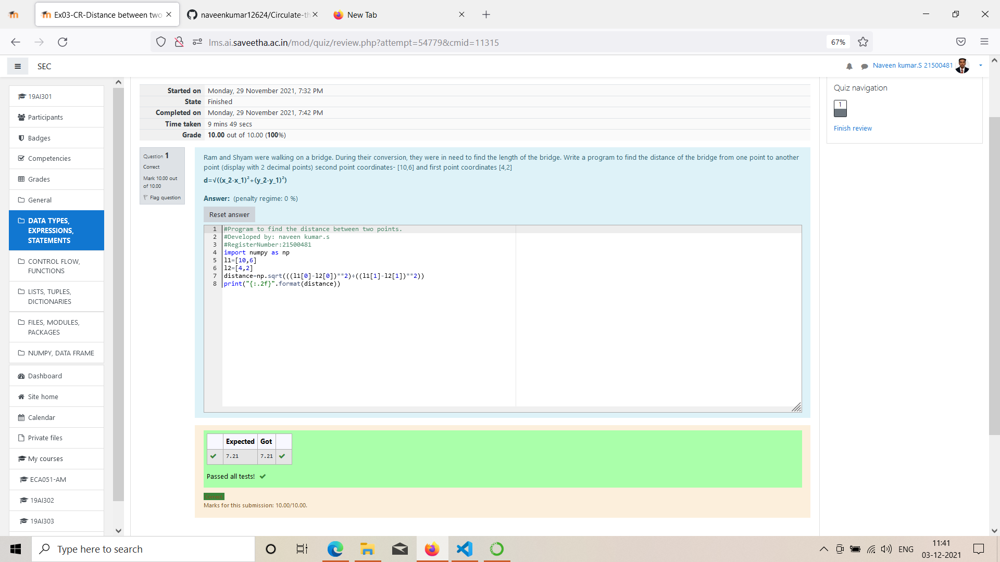

# DISTANCE-BETWEEN-TWO-POINTS

## AIM:
To write a python program to find the distance two 2 points
## ALGORITHM:
### Step 1: 
 Get the two coordinates from the user and name it as l1,l2
### Step 2: 
using the given formula 'd' we can calcuate the distance
### Step 3: 
Substitute the values in the distance formula  
### Step 4: 
then print the distance with using colon dot 2f for the condition of the answer must be in decimal. 
### Step 5: 
end the programme
### PROGRAM:
~~~
import numpy as np
l1=[10,6]
l2=[4,2]
distance=np.sqrt(((l1[0]-l2[0])**2)+((l1[1]-l2[1])**2))
print("{:.2f}".format(distance))
~~~
  

### OUTPUT:

### RESULT:

Hence the python program for distance between two points is shown.